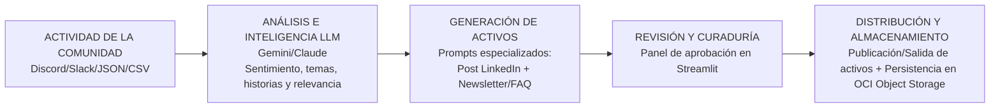

# G10-LATAM-EQUIPO43-CommunityLab

## Descripción del proyecto
Motor inteligente que transforma la actividad orgánica de una comunidad digital (mensajes, dudas, testimonios) en activos de marketing listos para publicar, usando IA generativa y automatización. Proyecto del Hackathon ONE G10 (Oracle Next Education & Alura).

## Estado actual
Sprint 1/5 — Setup inicial completado. Aún sin flujo funcional end-to-end.

## Arquitectura



Flujo general: interacciones (Discord/Slack/JSON/CSV) → análisis con LLM (sentimiento, tema y relevancia) → activos generados (Post LinkedIn + Newsletter/FAQ) → revisión y curaduría (aprobación en Streamlit) → salida y almacenamiento (salida de activos y almacenamiento en OCI Object Storage).

## Flujo de trabajo (Git)
Recordar no hacer push directo a main, todo por rama + pull requests

## Stack
- **LLM**: Google Gemini
- **Orquestación**: N8N (self-hosted en VM OCI)
- **Almacenamiento**: OCI Object Storage (Always Free)
- **Interfaz**: Streamlit
- **Gestión de tareas**: Trello
- **Comunicación**: Discord

## Estructura del repositorio
```
G10-LATAM-EQUIPO43-CommunityLab/

├── frontend/
├── backend/
├── data/
├── docs/
└── README.md
```

## Cómo correr el proyecto
_(se completa a partir del Sprint 2, cuando haya funcionalidad real)_

## Roadmap de sprints
- **Sprint 1** (setup): repo, Trello, OCI, bucket, JSON simulado, diagrama borrador
- **Sprint 2**: análisis de sentimiento y temas con Gemini
- **Sprint 3**: flujo de automatización en N8N con bifurcación condicional
- **Sprint 4**: integración con OCI Object Storage + interfaz Streamlit
- **Sprint 5**: demo final, 3 ejemplos, documentación completa
